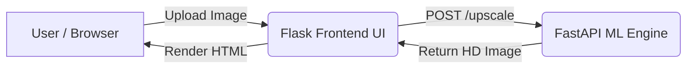

# AI-Based Image Upscaling Pipeline


This repository contains a full-stack, DevOps-ready pipeline for performing AI-based Image Upscaling using **RealESRGAN**. It leverages a microservices architecture for scalability and ease of deployment.

## 🏗️ Architecture



The system is broken down into two core microservices:
1. **Frontend (`/frontend`)**: A lightweight web application built with **Flask** that handles user uploads, serves static files, and routes image processing requests.
2. **ML Backend (`/ml_backend`)**: A highly performant inference server built with **FastAPI** that loads the PyTorch `RealESRGAN_x4plus` model into memory and processes incoming images on the fly.

## 🚀 Getting Started

The easiest way to spin up the entire application locally is by using **Docker Compose**.

### Prerequisites
- Docker & Docker Compose installed.
- Ensure ports `5000` and `8001` are available on your machine.

### Run Locally
```bash
# Clone the repository
git clone https://github.com/Arnav-Nehra28/image_upscallling_devops.git
cd image_upscallling_devops

# Spin up the services
docker-compose up --build
```
Once the containers are running, navigate to [http://localhost:5000](http://localhost:5000) in your browser. Upload a low-resolution image, and the AI backend will automatically upscale it!

## ☸️ Kubernetes & DevOps

This repository is built with production deployment in mind.

### Continuous Integration
A GitHub Actions workflow (`.github/workflows/ci.yml`) automatically builds the Docker images and pushes them to the GitHub Container Registry (GHCR) upon any push to the `main` branch. It also updates the Helm chart with the latest image tag (GitOps style).

### Helm Deployment
You can deploy the frontend to a Kubernetes cluster using the provided Helm chart:

```bash
helm upgrade --install upscaler ./helm/image-upscaling
```
*(Note: You will need to ensure your `ML_API_URL` environment variable in `values.yaml` points to your deployed ML backend).*

## 🔬 Research & Training
The raw TensorFlow 2 training code and experimentation scripts are preserved in the `research/esrgan-tf2` directory for reference and further tuning.
