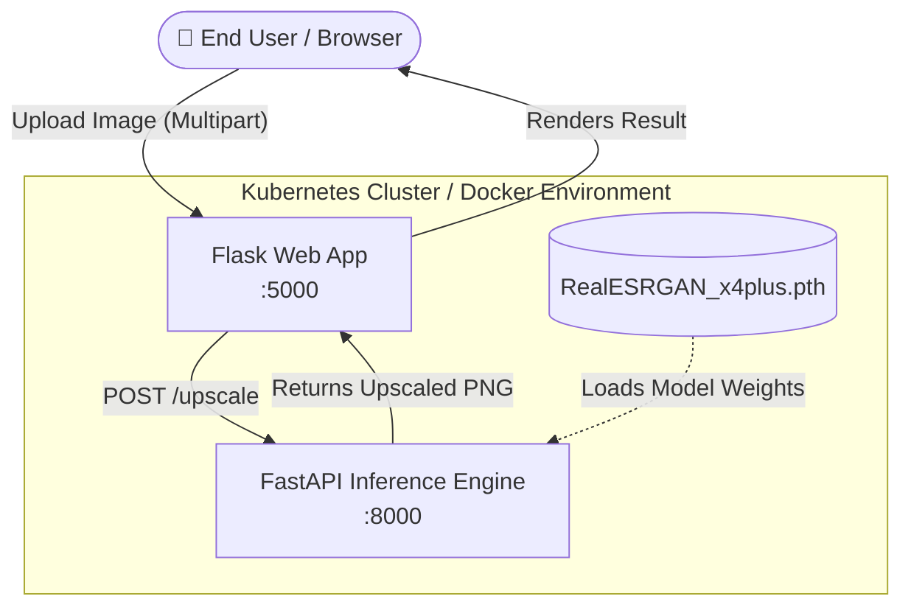

# 🚀 AI Image Upscaler: Enterprise-Grade DevOps Pipeline

[](https://github.com/Arnav-Nehra28/image_upscallling_devops/actions)
[](https://www.docker.com/)
[](https://kubernetes.io/)
[](https://www.python.org/)
[](https://fastapi.tiangolo.com/)

An enterprise-ready, microservices-based AI image upscaling application leveraging the state-of-the-art **RealESRGAN** (Enhanced Super-Resolution Generative Adversarial Networks) model. This project is built from the ground up with robust DevOps practices, featuring a containerized architecture, automated CI/CD pipelines via GitHub Actions, and Kubernetes/Helm deployments.

---

## 🏗️ System Architecture

The application is decoupled into two independent, highly-scalable microservices:

1. **Frontend (Flask)**: A lightweight, responsive web application serving as the API Gateway and User Interface.
2. **ML Backend (FastAPI)**: A high-performance inference engine that loads the PyTorch `.pth` models into memory and processes incoming tensors using the `realesrgan` upscaling algorithm.



---

## 🛠️ Technology Stack

### Application Layer
- **Backend Framework**: [FastAPI](https://fastapi.tiangolo.com/) (Asynchronous, High Performance)
- **Frontend Framework**: [Flask](https://flask.palletsprojects.com/) & Vanilla HTML/CSS
- **Machine Learning**: [PyTorch](https://pytorch.org/), OpenCV, RealESRGAN
- **Server**: Uvicorn & Gunicorn

### DevOps & Infrastructure
- **Containerization**: Docker & Docker Compose
- **Orchestration**: Kubernetes & Helm
- **CI/CD**: GitHub Actions (Automated Build, Tagging, and GHCR publishing)
- **GitOps**: Automated Helm values injection during pipeline execution

---

## 🚀 Getting Started

### Local Development (Docker Compose)
The absolute fastest way to spin up the entire infrastructure locally is via Docker Compose.

**Prerequisites:**
- Docker Engine & Docker Compose installed.
- Ensure ports `5000` (Frontend) and `8001` (ML Backend) are unbound.

```bash
# 1. Clone the repository
git clone git@github.com:Arnav-Nehra28/image_upscallling_devops.git
cd image_upscallling_devops

# 2. Spin up the microservices
docker-compose up --build
```
Navigate to [http://localhost:5000](http://localhost:5000) to access the UI. The ML Backend Swagger documentation is available at [http://localhost:8001/docs](http://localhost:8001/docs).

---

## ☸️ Kubernetes Deployment

This repository ships with a production-ready Helm chart located in `helm/image-upscaling/`.

### Deployment Steps
1. Ensure your `kubectl` context is set to your target cluster (e.g., Minikube, EKS, GKE).
2. Install the Helm chart:
```bash
helm upgrade --install ai-upscaler ./helm/image-upscaling \
  --namespace production \
  --create-namespace
```

**Customizing Values:**
You can override the default ML Backend endpoint directly in the `values.yaml`:
```yaml
env:
  ML_API_URL: "http://ml-backend-service:8000/upscale"
```

---

## ⚙️ CI/CD Pipeline (GitHub Actions)

A robust Continuous Integration pipeline is defined in `.github/workflows/ci.yml`. Upon every push to the `main` branch, the pipeline executes the following stages:

1. **Checkout & Setup**: Initializes Docker Buildx.
2. **GHCR Authentication**: Logs into the GitHub Container Registry.
3. **Build & Publish**: Builds the `frontend` image and pushes it to GHCR with dynamic SHA and `latest` tags.
4. **GitOps CD**: Automatically updates `helm/image-upscaling/values.yaml` with the newly generated image tag and pushes the commit back to the repository, ready for tools like ArgoCD or Flux to sync.

---

## 📂 Repository Structure

```text
image_upscallling_devops/
├── frontend/               # Flask Web UI Service
│   ├── app.py              # Application entrypoint
│   ├── Dockerfile          # Frontend container configuration
│   └── static/             # Assets and upload/output directories
├── ml_backend/             # FastAPI Inference Service
│   ├── main.py             # Inference API and Model Initialization
│   ├── Dockerfile          # PyTorch-optimized container configuration
│   ├── requirements.txt    # ML dependencies
│   └── model/              # PyTorch .pth model weights
├── helm/                   # Kubernetes deployment charts
│   └── image-upscaling/    # Helm configurations (Chart.yaml, values.yaml)
├── research/               # Legacy R&D and training code
│   └── esrgan-tf2/         # TensorFlow 2 training implementations
├── docker-compose.yml      # Local development orchestration
└── README.md               # You are here!
```

---

## 🧠 API Reference (ML Backend)

### `POST /upscale`
Accepts a raw image file and returns a `4x` upscaled PNG.

**Request:**
- `Content-Type: multipart/form-data`
- `file`: The binary image payload (JPEG/PNG).

**Response:**
- `Content-Type: image/png`
- Returns the raw bytes of the upscaled image.

---
*Built with ❤️ for high-performance AI inference and scalable DevOps architecture.*
